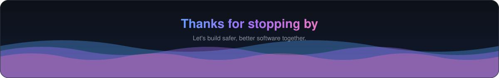

<div align="center">



<br/><br/>



<br/><br/>



</div>

<br/>

## 👋 About This Repository

Hi, I'm **Harshit Gupta**, a B.Tech (Information Technology) student at ABV-IIITM Gwalior.

This repository is a living record of my open-source work: what I fixed, why it mattered, and how each pull request went from first commit to merge. My core focus is **defensive programming**: making software fail clearly and safely when it receives bad input, and proving it with tests.


## 🎯 The Scoreboard

<div align="center">

</div>

| Organization | Project | PRs | Merged |
| :--- | :--- | :---: | :---: |
| **XRPLF** (XRP Ledger Foundation) | [rippled](https://github.com/XRPLF/rippled) | 6 | 2 |
| **P4Lang** | [behavioral-model](https://github.com/p4lang/behavioral-model) | 1 | 1 |
| **OpenTimelineIO** (Academy Software Foundation) | [raven](https://github.com/OpenTimelineIO/raven) | 1 | 0 |


## ✅ Merged Contributions

### 🔐 [XRPLF/rippled #7583](https://github.com/XRPLF/rippled/pull/7583): Validate `vetoed` in the `feature` RPC

  

- **Problem:** a non-boolean `vetoed` value could throw an exception or silently coerce to `false`, accidentally **un-vetoing an amendment**.
- **Fix:** an explicit `isBool()` check that returns `invalidParams` for any other type.
- **Closes:** [#6757](https://github.com/XRPLF/rippled/issues/6757)

### 🔐 [XRPLF/rippled #7582](https://github.com/XRPLF/rippled/pull/7582): String validation for `channel_id` and `signature`

  

- **Problem:** `channel_authorize` and `channel_verify` accepted integers and arrays, relying on silent coercion.
- **Fix:** `isString()` checks before conversion, returning `invalidParams` for the wrong type, with regression tests in `PayChan_test.cpp`.
- **Closes:** [#6765](https://github.com/XRPLF/rippled/issues/6765)

### ⚙️ [P4Lang/behavioral-model #1409](https://github.com/p4lang/behavioral-model/pull/1409): Remove dead `bmv2.org` references

 

- **Problem:** the README linked to a domain that no longer existed, and the Doxygen CI workflow failed on every run trying to upload to it.
- **Fix:** removed the dead link and disabled the failing S3 upload step, restoring a clean CI signal.
- **Closes:** [#1408](https://github.com/p4lang/behavioral-model/issues/1408)


## 🟡 In Review

| Pull Request | What it does | Where it stands |
| :--- | :--- | :--- |
| [rippled #7606](https://github.com/XRPLF/rippled/pull/7606) | `fetch_info`: strict boolean check on `clear`. Values like `"false"`, `[1]` or `{}` used to be treated as `true` and could clear ledger-fetch state. Includes tests and changelog. | 🛠️ Addressing maintainer feedback |
| [rippled #7595](https://github.com/XRPLF/rippled/pull/7595) | `log_level`: type checks on `severity` and `partition`, so bad input returns `invalidParams` instead of throwing. Includes tests and changelog. | ⏳ Awaiting final review |
| [rippled #7590](https://github.com/XRPLF/rippled/pull/7590) | `owner_info`: type validation for `account` and `ident`, plus correct ledger-selector handling. | 🛠️ Iterating on review feedback |
| [rippled #7589](https://github.com/XRPLF/rippled/pull/7589) | `account_lines`: validates that `peer` is a string before parsing. | ⏳ Awaiting review |


## 🔒 Spotlight: Hardening `rippled`'s RPC Layer

Most of my `rippled` pull requests share one root cause: JSON values were converted with `asBool()` or `asString()` **without checking their type first**. A malformed request could throw, or worse, be silently coerced into a valid-looking value with real side effects.

<div align="center">

</div>

A simplified illustration of the fix:

```cpp
// Before: any JSON type is silently coerced
bool clear = params[jss::clear].asBool();

// After: the wrong type is rejected explicitly
if (params.isMember(jss::clear) && !params[jss::clear].isBool())
    return rpcError(rpcINVALID_PARAMS);

bool clear = params.isMember(jss::clear) && params[jss::clear].asBool();
```

Every PR in the series follows the same standard: **fix, test, document**.


## 🛠️ How I Approach a Contribution

<div align="center">

</div>


## 🔴 Closed: What I Learned

### 🎨 [OpenTimelineIO/raven #161](https://github.com/OpenTimelineIO/raven/pull/161): Official Clip Color schema support

I set out to make Raven read and write the official OpenTimelineIO Clip Color schema while staying compatible with its legacy color metadata. Maintainer feedback pushed the work further: Raven is an *inspection* tool, so it must show a file's contents exactly as they are and never lose a custom color. That led to preserving arbitrary RGB values instead of snapping them to a fixed palette.

I closed this PR while the OpenTimelineIO Technical Steering Committee finalizes its policy on LLM-assisted contributions, which the maintainers asked me to wait for before moving forward.

**Takeaways:** a "simple" schema change can hide data-loss bugs, a tool that displays data has to be faithful to it, and it pays to understand how real users work (here, how editing software treats clip colors) before writing code.


## 💡 Skills Demonstrated

| Area | Evidence |
| :--- | :--- |
| **Modern C++** | RPC handlers and unit tests in a large production codebase |
| **Defensive programming** | Type validation, safe error returns, no silent coercion |
| **Testing** | Regression tests for invalid-input paths (`PayChan_test.cpp`, `FetchInfo_test.cpp`) |
| **Technical writing** | API changelog entries, README and documentation cleanup |
| **CI/CD** | Removed a failing GitHub Actions deployment step |
| **Collaboration** | Iterating on maintainer and automated review feedback, rebasing on `develop`, merge queues, signed commits |

<br/>

<div align="center">

**GitHub:** [@harshitgupta62](https://github.com/harshitgupta62) · Every pull request above links to its discussion, reviews, and CI results.



</div>
